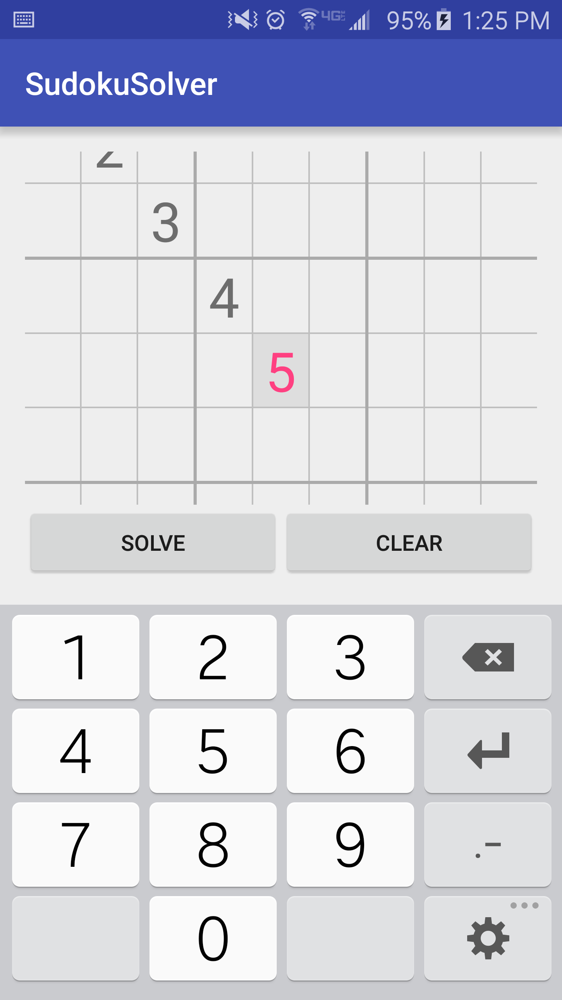
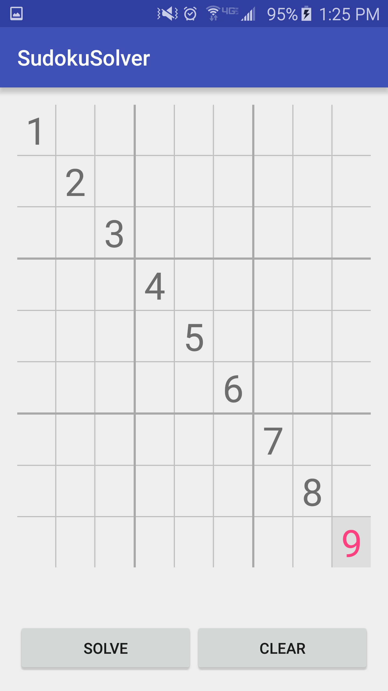
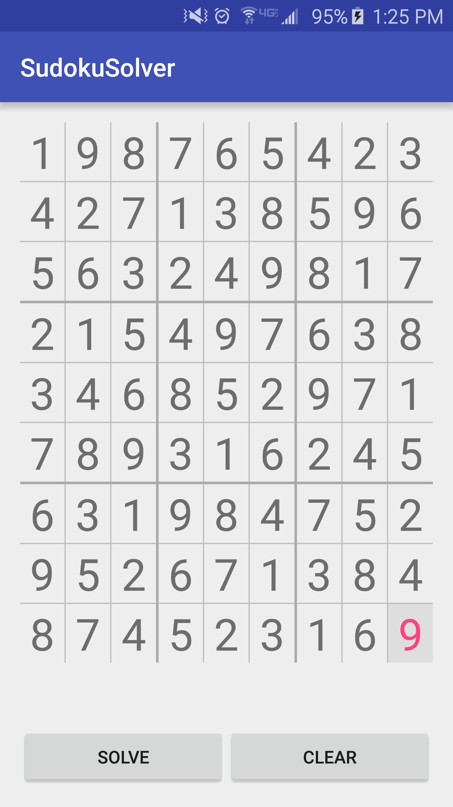
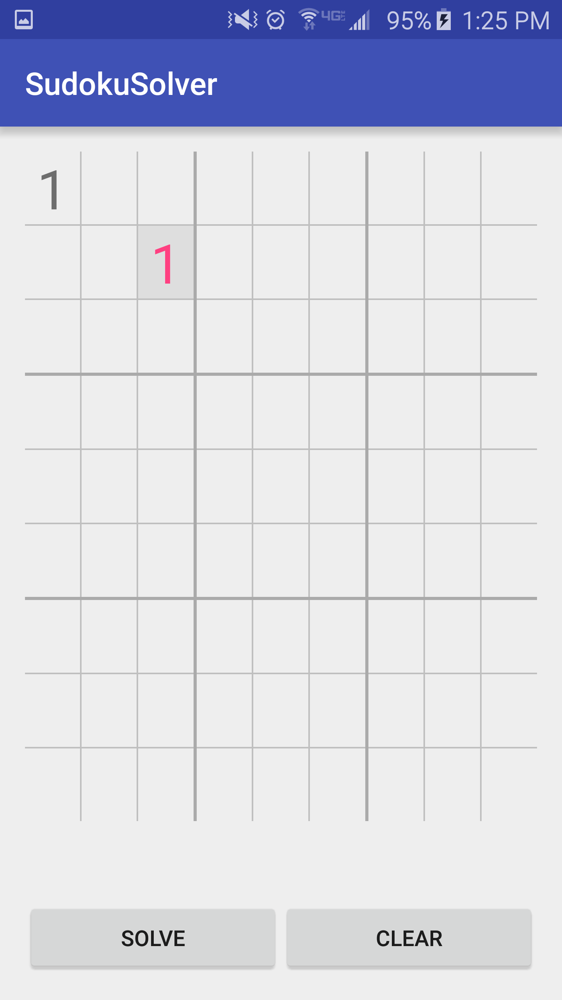
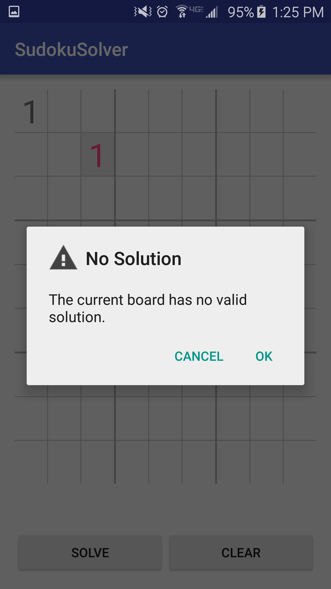

# Sudoku Solver Android

This is just a simple android app the solves sudoku boards. You can read about the underlying algorithm on [here](https://github.com/davidretler/SudokuSolver).

## How to Build

It's simple, clone this whole repository and import the directory into Android Studio.

## How to Use

Tap a cell to modify its value. Use the `solve` button to solve the board and the `clear` button to erease all the values. The app will tell you if the board you input cannot be solved.

## Screenshots

Enter values

Before solving

After solving

A board with no solutions

The error message

